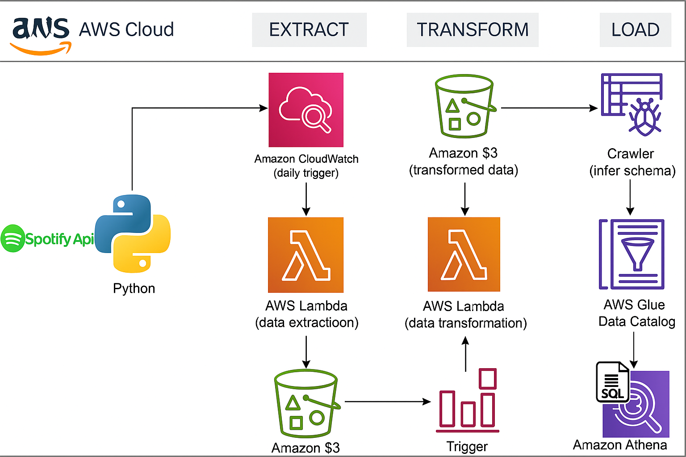
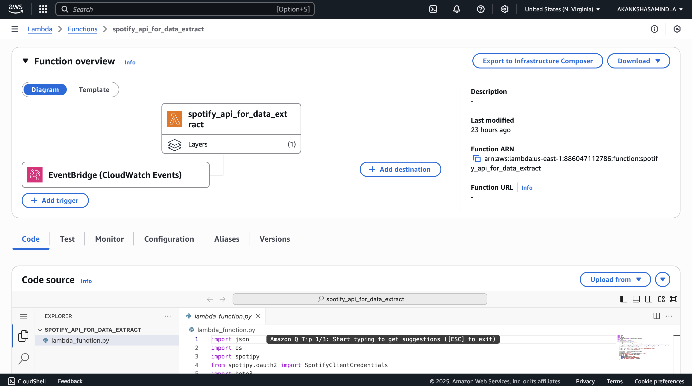
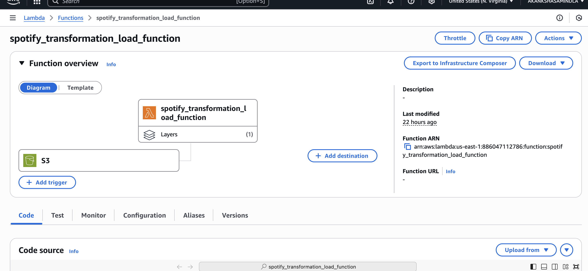
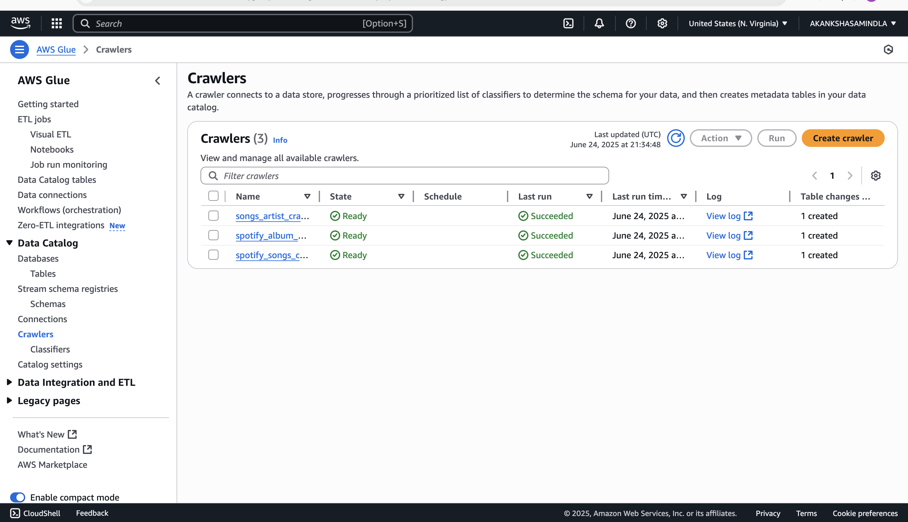
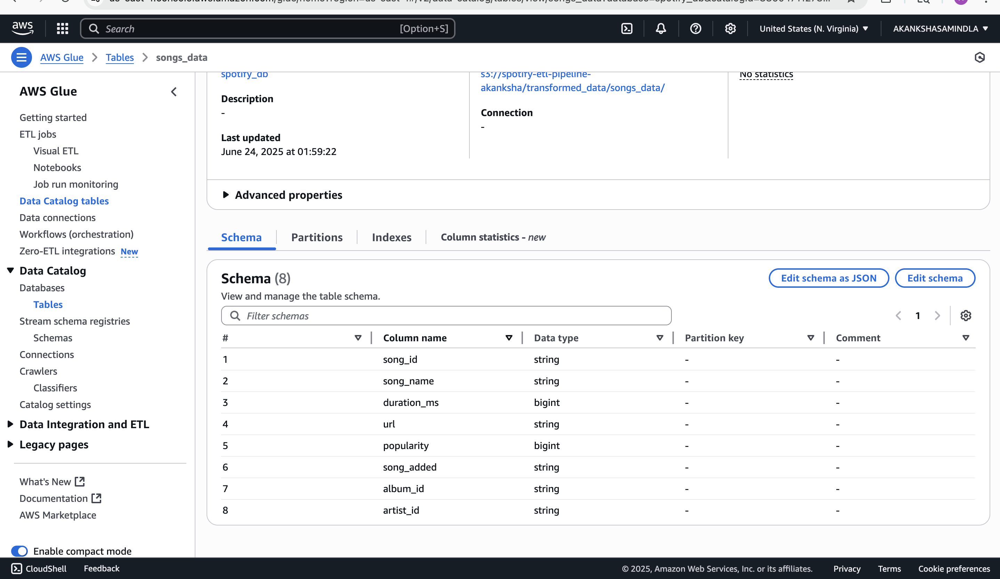
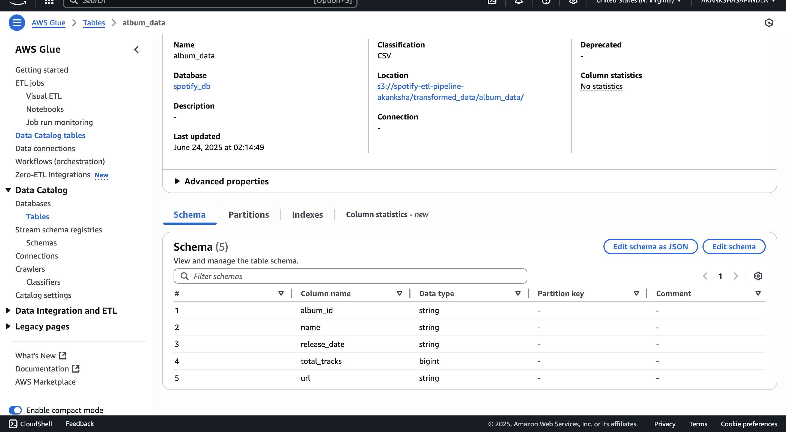
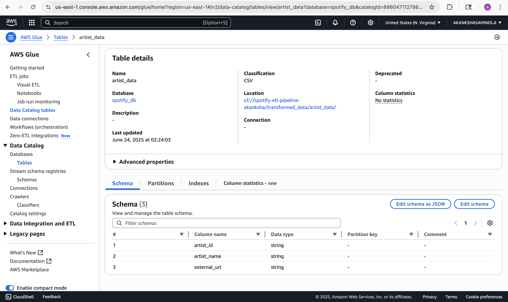
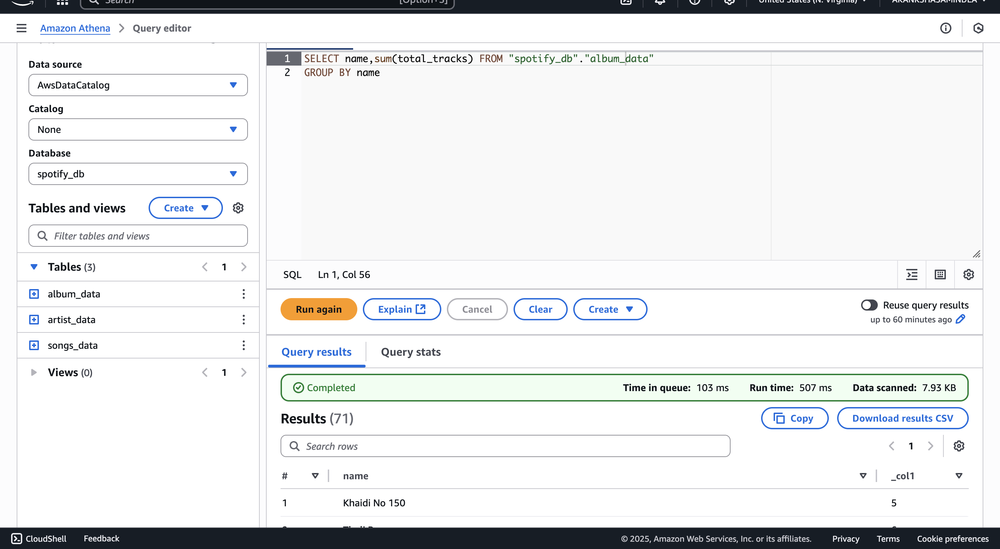

# 🎵 Spotify ETL Data Pipeline using AWS

This project demonstrates an end-to-end ETL pipeline that extracts music metadata from the Spotify API, transforms it using AWS Lambda, and loads it into Amazon S3, with querying capabilities via Athena.

---

## 🗂️ Architecture Overview

The following architecture shows how the components of this ETL pipeline interact:

📸 _Diagram_: High-level architecture of the Spotify ETL pipeline  


---

## 🚀 Step-by-Step Pipeline Execution

### Step 1: Extract Spotify API Data and Store in S3

- A Lambda function is scheduled using **CloudWatch Events** to run at fixed intervals.
- It fetches **songs, albums, and artist metadata** using the Spotify Web API (via Spotipy).
- Data is pushed into an **S3 bucket** under structured folders:

```bash
/spotify-etl-bucket/
├── raw/
│ ├── to-be-processed/
│ └── raw-processed/
└── transformed/
├── songs/
├── albums/
└── artists/
```

📸 _Screenshot_: Lambda function and CloudWatch trigger  


---

### Step 2: Transform Data via AWS Lambda

- The same Lambda function listens for new files in `raw/to-be-processed/`.
- It parses complex JSON payloads from Spotify API.
- Transforms are applied to clean and flatten:
  - **Songs data**
  - **Albums data**
  - **Artist data**
- Transformed data is stored in respective `transformed/` folders in S3.

📸 _Screenshot_: Data transformation Lambda code  


---

### Step 3: Move Processed Files to Archive

- After transformation, raw files are moved from `to-be-processed/` to `raw-processed/` as a backup/archive.
- This keeps the pipeline clean and prevents redundant processing.

---

### Step 4: Infer Schema using AWS Glue

- An AWS Glue **Crawler** was configured to scan the `transformed/` S3 folders.
- It inferred schemas and created three separate tables under a Glue **Database**.
- These tables are used later in Athena for querying.

📸 _Screenshot_: AWS Glue Crawler Configuration  


#### 🎵 Songs Table Schema
- Contains details like song name, duration, popularity, and track ID.
📸 _Screenshot_: Songs Table Schema  


#### 💿 Albums Table Schema
- Captures album name, release date, total tracks, and album ID.
📸 _Screenshot_: Albums Table Schema  


#### 🎤 Artists Table Schema
- Includes artist name, genre, popularity, and ID.
📸 _Screenshot_: Artists Table Schema  


---

### Step 5: Query Using Amazon Athena

- Used **Amazon Athena** to run SQL queries on the transformed data.
- Example queries include retrieving top songs, artists, albums, etc.

📸 _Screenshot_: Sample Athena query  


---

## ⚙️ Technologies Used

| Tool             | Purpose                             |
|------------------|-------------------------------------|
| **Spotify API**  | Data source for music metadata      |
| **AWS Lambda**   | Data extraction and transformation  |
| **Amazon S3**    | Storage for raw and processed data  |
| **AWS Glue**     | Schema inference and table creation |
| **Amazon Athena**| SQL-based querying of processed data|
| **CloudWatch**   | Triggering Lambda on schedule       |
| **Python**       | ETL logic using Spotipy & Boto3     |

---
